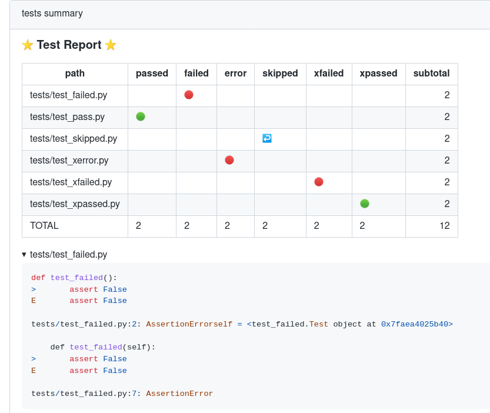
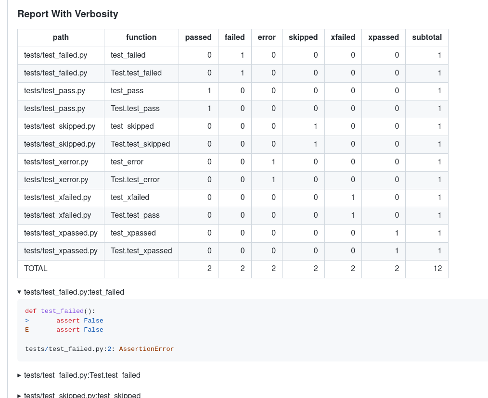

# Pytest GitHub Report

This is an example of how we can use [GitHub reports]() with [pytest](https://github.com/thombashi/pytest-md-report) to
generate a nice markdown matrix of results. The [tests](tests) here are from the [pytest-md-report](https://github.com/thombashi/pytest-md-report)
repository.

## Usage

### Local

First, install dependencies:

```bash
$ pip install -r requirements.txt
```

And then run tests to see the markdown output (that will get piped into GitHub):

```bash
$ pytest --github-report tests/
```

This markdown output is provided via [pytest-md-report](https://github.com/thombashi/pytest-md-report)
and you can see other ways to customize it there!

### GitHub Actions

To make this work in GitHub actions, it's actually very simple! You can either
run the same command:

```yaml
  - name: Report via Command Line
    run: pytest --github-report tests
```

Or export via the environment (e.g., good if you don't want to change your default
testing command but want it to work during GitHub actions).

```yaml
  - name: Report via Environment
    env:
      pytest_github_report: true
    run: pytest tests
```

### Configuration

Advanced configuration can be done via the environment since we are scoping to GitHub
actions.

#### Enable

If you want to have the report work from the environment (ideal if you don't want to
change the command to run your tests) you can do:

```bash
export pytest_github_report=true
```

If that value is found with any none Null value (e.g., True or yes) a report
will be generated given this module is installed.

#### Title

To set a particular title for your report:

```yaml
  - name: Report via Environment
    env:
      pytest_github_report: true
      pytest_report_title: "Formatting"
    run: pytest tests
```

#### Zeros

By default, we only show colored emojis to indicate a success or failure.
To use a count (value) instead:


```yaml
  - name: Report via Environment
    env:
      pytest_github_report: true
      pytest_use_zeros: true
    run: pytest tests
```

#### Blanks

Or a blank value:

```yaml
  - name: Report via Environment
    env:
      pytest_github_report: true
      pytest_use_blanks: true
    run: pytest tests
```

#### Detail

By default, we output a simplified view, which is `pytest_verbosity: 0`. You actually have two options for verbosity:
This first is the default (0), which shows a summary by file:

```yaml
  - name: Report via Environment
    env:
      pytest_verbosity: 0
    run: pytest --github-report tests
```
Notice below that although the table shows summary by file, the output section shows both failures
within the file:



The second shows per test results (adding the function name) and adds more detail to the matrix:

```yaml
  - name: Report via Environment
    env:
      pytest_verbosity: 2
    run: pytest --github-report tests
```



In this case, the detail is on the level of the function.
But either way, detail is printed below the matrix, as you can see above!


#### Emojis

Choose the emijos (or characters) you want for your tests! A helpful
[emoji guide is here](https://gist.github.com/rxaviers/7360908).

```yaml
  - name: Report via Environment
    env:
      pytest_github_report: true
      pytest_report_title: ":unicorn: Report With Custom Emojis :unicorn:"
      pytest_passed_emoji: ":green_heart:"
      pytest_failed_emoji: ":heart:"
      pytest_xpassed_emoji: ":bangbang:"
      pytest_xfailed_emoji: ":bangbang:"
      pytest_skipped_emoji: ":shipit:"
    run: pytest tests
```

Here is an example with the custom emojis above!


You can see the [GitHub workflow](.github/workflows/main.yml)
for these examples.


## Thanks!

The markdown functionality here is based off of [thombashi/pytest-md-report](https://github.com/thombashi/pytest-md-report)
which is released under an MIT license that we credit in [.github/LICENSE](.github/LICENSE).
